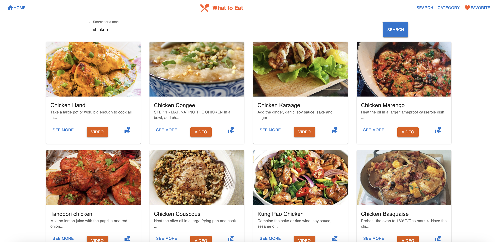
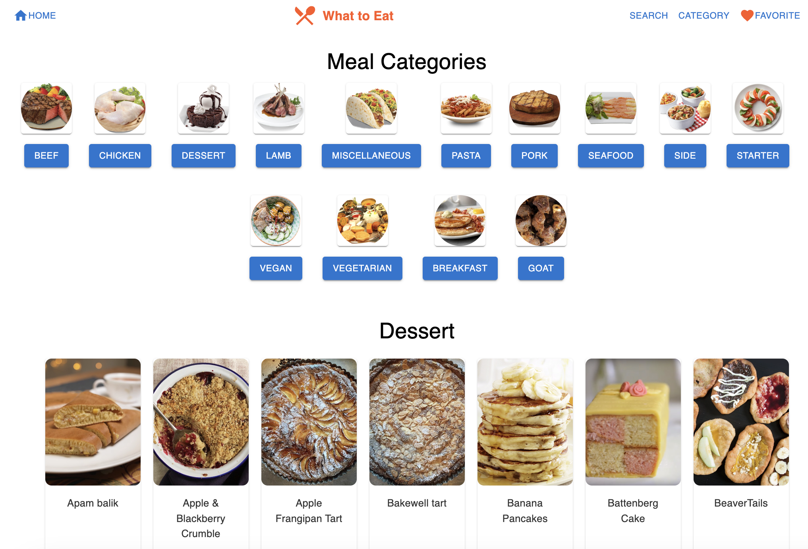
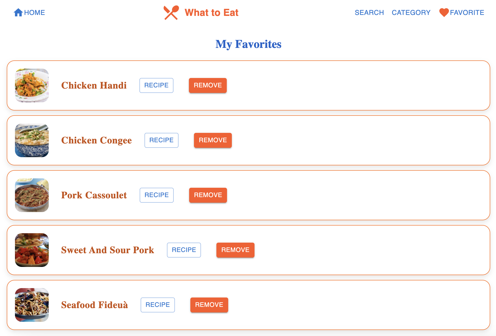

## Live Demo

- https://what-to-eat-seven.vercel.app/

#Screetshot

## Home

## Search

## Category

## Favorite

## User Stories: 
- As a user, I want to browse through different meal categories so that I can discover new recipes easily.
- As a user, I want to search for meals based on my cravings so that I can find the perfect recipe to try.
- As a user, I want to view detailed information about a meal, including ingredients, instructions, and a video tutorial, so that I can cook it with ease.
- As a user, I want to save my favorite meals so that I can easily access them later.
- As a user, I want to remove meals from my favorites list if I no longer want them there.
- As a user, I want to navigate easily between meal categories, search results, and my favorites.

## Technologies Used

- HTML 
- CSS
- JAVASCRIPT
- REACT
- METURIAL-UI

## Key Learning
- React Router: Gained a strong understanding of how to set up routes and navigate between pages using useNavigate and useParams.
- Material-UI: Learned to style components with Material-UI, utilizing pre-built components like Button, Card, and Typography to create a professional, responsive layout.
- State Management: Enhanced understanding of React state management, specifically using useState to handle dynamic data such as favorites and meal details.
- API Fetching: Gained experience in fetching data from an API (TheMealDB) using useEffect and handling asynchronous operations, including error handling.
- Conditional Rendering: Practiced conditional rendering to display different content based on user actions, like showing meal details or handling empty search results.

## Future plans 

- Add the location to buy a meal
- Online Purchase ingredients of the recipes

# Attributions 

- https://devtoantdp425react-fetch-data-from-api-with-useeffect-27le
- https://medium.com/@omar1.mayallo4/react-hooks-useeffect-problems-in-data-fetching-5e2abc37a1c9
- https://medium.com/@bobjunior542/using-usenavigate-in-react-router-6-a-complete-guide-46f51403f430
- https://refine.dev/blog/react-router-useparams/#how-to-use-the-useparams-hook
- https://api.reactrouter.com/dev/functions/react_router.useParams.html
- https://mui.com/material-ui/react-app-bar/ 
- https://mui.com/system/getting-started/the-sx-prop/

